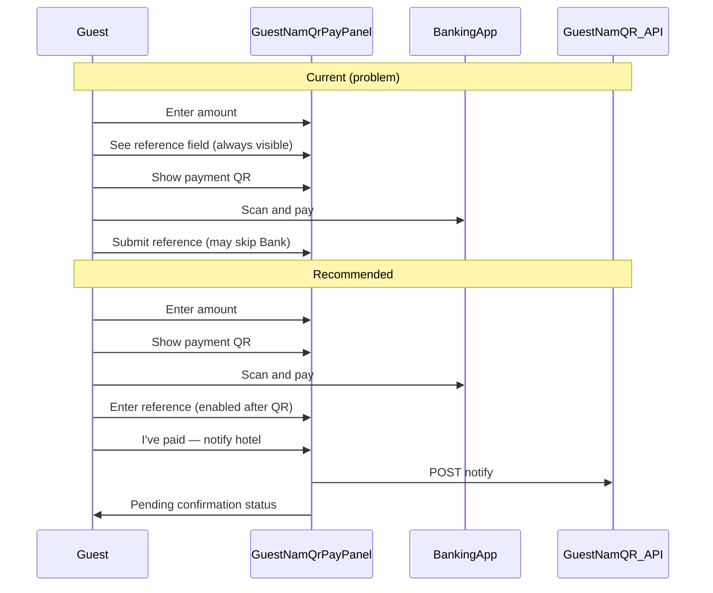

# Hotel Etuna — Full Frontend UX Audit

**Date:** 2026-06-16  
**Method:** Jakob's Law + NN/g 10 usability heuristics + Part 9 (Master Guide) / Buffr Etuna design canon  
**Scope:** Entire `hotel-etuna` frontend (115 `app/**/page.tsx` routes, 31 `components/features/*` domains). Backend/API implementation out of scope except UX impact of responses.  
**Inventory source:** Project file tree snapshot 2026-06-16  
**Status:** Findings only — no code changes in this pass

---

## 1. Executive summary

Hotel Etuna has a **mature component structure** (domain folders, `components/ui` wrappers, shared empty/error states, Playwright design-system smoke tests). The highest-risk UX gaps cluster around **money paths** and **status communication**:

| Rank | Theme | Why it matters |
|------|--------|----------------|
| 1 | **Deposit auto-redirect without confirmation** | Users leave the site before seeing amount/disclosure — trust and PSD-12-style initiation clarity |
| 2 | **Payment step order (NamQR)** | Guest can notify hotel before scanning QR — false pending claims, desk rework |
| 3 | **Stale folio after NamQR confirm (staff)** | Staff sees success but balance does not refresh — reconciliation errors |
| 4 | **Broken “Book Now” deep link** | Primary marketing CTA does not open booking — conversion leak |
| 5 | **Error/success styling drift** | Folio errors shown as `alert-info`; inconsistent `role="alert"` on money forms |

**Counts:** 4 Blocker/High payment-related · 28 Medium · 12 Low · **44 total findings**

**Recommended fix waves:** P0 payments → P1 guest folio + public booking → P2 staff desk/partner → P3 marketing polish (aligns with `TASK.md` #13 skip links / contact map).

---

## 2. Surface inventory

### 2.1 Route groups (`app/`)

| Surface | Route count (representative) | Layout / chrome |
|---------|-------------------------------|-----------------|
| Public / marketing | `/`, `/about`, `/contact`, `/dining`, `/facilities/*`, `/rooms/*`, `/partners/*`, `/introducers-directory`, `/legal/*` | `NavigationHeader`, `PublicFooter`, marketing sections |
| Public booking | `/public-properties/[slug]`, `.../book`, `.../menu` | Minimal card shell (no full marketing chrome) |
| Auth | `/(auth)/login`, `register`, `forgot-password`, `reset-password`, `verify-email` | Auth layout |
| Guest hub | `/guest`, `/guest/stays/[bookingId]`, `/guest/room`, `/guest/profile`, `/guest/loyalty`, `/guest/dsar`, `/guest/welcome` | `app/guest/layout.tsx` sub-nav |
| Staff dashboard | `/(dashboard)/*` (~70 pages): bookings, payments, housekeeping, restaurant, CRM, reports, compliance, fraud, payroll, staff, settings, Sofia, admin/platform | `Sidebar` + `Header`, drawer on mobile |
| Partner portal | `/partner/dashboard`, `bookings`, `rates`, `rooms`, `my-property`, `settings` | `PartnerSidebar` off-canvas |
| Payment outcomes | `/payment/success`, `/payment/failed`, `/payment/booking-deposit`, `/restaurant/reservation/pay` | Standalone — no site nav |
| Global | `layout.tsx`, `loading.tsx`, `not-found.tsx`, `/offline` | Providers, error boundaries |

### 2.2 Component layers

| Layer | Path | Files (approx.) |
|-------|------|-----------------|
| UI primitives | `components/ui/*` | Button (pill `rounded-full`), Input, Card, Modal, Toast, Table, Tabs |
| Features | `components/features/<domain>/` | 31 domains (guest, booking, folio, payments, admin, …) |
| Shared chrome | `components/shared/*` | Sidebar, Header, Footer, EmptyState, ErrorDisplay, PageHeader |
| Payments | `components/payments/*` + `features/payments/*` | Adumo, NamQR, deposit cards |
| Brand | `components/brand/*` | Logo, mark |

### 2.3 Critical journeys (pass/fail summary)

| Role | Journey | Pass? | Notes |
|------|---------|-------|-------|
| Visitor | Home → Book Now → select dates → deposit | **Fail** | `?book=1` not handled; deposit page auto-redirects |
| Guest | Stay → folio → NamQR pay → pending | **Partial** | Flow works but step order wrong; status ARIA weak |
| Guest | Stay → card pay (Adumo) | **Pass** | Disclosure + explicit card start in folio |
| Front desk | Paste UUID → NamQR → confirm folio | **Partial** | UUID paste novice-hostile; folio may not refresh |
| Front desk | Pending queue → approve | **Partial** | Label inconsistency; `window.prompt` on reject |
| Partner | Dashboard → bookings | **Pass** | Short nav (7 items) |
| Staff | Login → dashboard stats | **Partial** | Infinite spinner if `tenantId` missing |

---

## 3. Findings by surface

### 3.1 Public / marketing

#### UX-PUBLIC-01 — Blocker: “Book Now” CTA does not open booking widget

| Field | Value |
|-------|--------|
| **Files** | `components/sections/landing/NavigationHeader.tsx` L61–63, L114–116; `app/rooms/page.tsx` (no `book` query handling) |
| **Journey** | Visitor clicks primary CTA |
| **Heuristic** | Jakob's Law, #4 Consistency |
| **Severity** | **High** |
| **Issue** | CTA links to `/rooms?book=1` but rooms page never reads `book=1` — users land on browse with no booking affordance. |
| **Recommendation** | Scroll/focus `#booking` on home, or handle `?book=1` on `/rooms` with widget expand. |
| **Effort** | S |

#### UX-PUBLIC-02 — High: Silent empty state after availability search

| Field | Value |
|-------|--------|
| **Files** | `components/sections/landing/LandingBookingWidget.tsx` ~L200–249 |
| **Journey** | Check availability → zero results |
| **Heuristic** | #1 Visibility of system status |
| **Severity** | **High** |
| **Issue** | No “no rooms for these dates” message — users think search failed or UI is broken. |
| **Recommendation** | Empty state with dates, contact CTA, suggest alternate dates. |
| **Effort** | S |

#### UX-PUBLIC-03 — High: Server fetch failures show empty content without explanation

| Field | Value |
|-------|--------|
| **Files** | `app/page.tsx` ~L251–357 |
| **Journey** | Homepage rooms/partners sections when DB errors |
| **Heuristic** | #1 Status, #9 Recovery |
| **Severity** | **High** |
| **Issue** | Errors logged server-side only; user sees empty sections. |
| **Recommendation** | User-safe banner + retry; optional static fallback. |
| **Effort** | M |

#### UX-PUBLIC-04 — Medium: Partner property book page lacks marketing chrome

| Field | Value |
|-------|--------|
| **Files** | `app/public-properties/[slug]/book/page.tsx` |
| **Journey** | Partner network booking |
| **Heuristic** | Jakob's Law, #4 Consistency |
| **Severity** | Medium |
| **Issue** | Bare card vs `/contact` and `/rooms` with full header/footer — feels like leaving the site. |
| **Recommendation** | Reuse `NavigationHeader` + `Footer` or slim book shell. |
| **Effort** | S |

#### UX-PUBLIC-05 — Medium: Booking widget date validation gaps

| Field | Value |
|-------|--------|
| **Files** | `components/sections/landing/LandingBookingWidget.tsx` L164–189, L82–85 |
| **Journey** | Date selection before search |
| **Heuristic** | #5 Error prevention |
| **Severity** | Medium |
| **Issue** | No client guard for checkout ≤ check-in or past dates; custom `rounded-lg` inputs vs shared form primitives. |
| **Recommendation** | `min` on date inputs; validate range; align with `components/ui/Input`. |
| **Effort** | S |

#### UX-PUBLIC-06 — Medium: Availability errors lack live region semantics

| Field | Value |
|-------|--------|
| **Files** | `components/sections/landing/LandingBookingWidget.tsx` ~L199 vs L204 |
| **Journey** | Failed availability API |
| **Heuristic** | #1 Status, a11y |
| **Severity** | Medium |
| **Issue** | Availability errors are plain `
`; booking errors use `role="alert"` — inconsistent. |
| **Recommendation** | `alert alert-error` + `role="alert"` for both. |
| **Effort** | S |

#### UX-PUBLIC-07 — Low: Nested interactive elements in header CTA

| Field | Value |
|-------|--------|
| **Files** | `components/sections/landing/NavigationHeader.tsx` L61–63 |
| **Heuristic** | #4 Consistency, a11y |
| **Severity** | Low |
| **Issue** | `<Link><Button></Button></Link>` — invalid nesting for assistive tech. |
| **Recommendation** | `Button asChild` + `Link` child. |
| **Effort** | S |

#### UX-PUBLIC-08 — Low: No skip-to-main link (known gap)

| Field | Value |
|-------|--------|
| **Files** | Global — no `skip-link` in `app/layout.tsx` or `globals.css` |
| **Journey** | Keyboard users on every public page |
| **Heuristic** | Part 9.9 a11y |
| **Severity** | Low |
| **Issue** | Documented in `TASK.md` § Production gaps #13; not implemented. |
| **Recommendation** | Add `buffr-skip-link` or daisyUI skip pattern to root layout. |
| **Effort** | S |

---

### 3.2 Guest hub

#### UX-GUEST-01 — High: Dashboard insight tiles show zeros while loading

| Field | Value |
|-------|--------|
| **Files** | `components/features/guest/GuestDashboard.tsx` L75–97; `useGuestHub.ts` |
| **Journey** | Guest opens `/guest` |
| **Heuristic** | #1 Visibility |
| **Severity** | **High** |
| **Issue** | Stats render before `useGuestHub` resolves — misleading “0 nights / N$0 spend”. |
| **Recommendation** | Gate on `hub.loading` with skeleton or `aria-busy`. |
| **Effort** | S |

#### UX-GUEST-02 — High: Folio errors displayed as info alerts

| Field | Value |
|-------|--------|
| **Files** | `components/features/guest/GuestFolioPanel.tsx` L266–269 (also settle/order paths set `message` on error) |
| **Journey** | Room service order or settle failure |
| **Heuristic** | #1 Status, #9 Recovery |
| **Severity** | **High** |
| **Issue** | Single `message` state always renders `alert alert-info` — errors look like neutral/success guidance. |
| **Recommendation** | Split `error` / `success`; `alert-error` + `role="alert"` for failures. |
| **Effort** | S |

#### UX-GUEST-03 — Medium: Guest sub-nav lacks active route indication

| Field | Value |
|-------|--------|
| **Files** | `app/guest/layout.tsx` L26–38 |
| **Journey** | Navigate between guest sections |
| **Heuristic** | #6 Recognition |
| **Severity** | Medium |
| **Issue** | All links styled identically — no `aria-current="page"`. |
| **Recommendation** | `usePathname()` + active styles (`bg-ci-primary/10`). |
| **Effort** | S |

#### UX-GUEST-04 — Medium: Folio payment rails not progressively disclosed

| Field | Value |
|-------|--------|
| **Files** | `components/features/guest/GuestFolioPanel.tsx` L336–385 |
| **Journey** | Pay folio — choose method |
| **Heuristic** | #6 Recognition, choice overload |
| **Severity** | Medium |
| **Issue** | Cash, card, NamQR, open banking stacked in one card — high cognitive load (Hick's Law). |
| **Recommendation** | `tabs` or accordion: one expanded rail; recommend card or NamQR first. |
| **Effort** | M |

#### UX-GUEST-05 — Medium: Stays list error only offers “Sign in”

| Field | Value |
|-------|--------|
| **Files** | `components/features/guest/GuestStaysList.tsx` L40–48 |
| **Journey** | Hub fetch fails for logged-in user |
| **Heuristic** | #9 Recovery |
| **Severity** | Medium |
| **Issue** | Transient API errors show sign-in CTA instead of retry. |
| **Recommendation** | Retry button when session exists; sign-in only on 401. |
| **Effort** | S |

#### UX-GUEST-06 — Medium: Folio loading silent for screen readers

| Field | Value |
|-------|--------|
| **Files** | `components/features/guest/GuestFolioPanel.tsx` ~L204–205 |
| **Heuristic** | #1 Status, a11y |
| **Severity** | Medium |
| **Issue** | Skeleton uses `aria-hidden` without `aria-busy` / status text. |
| **Recommendation** | Container `aria-busy="true"` + `role="status"` “Loading folio…”. |
| **Effort** | S |

---

### 3.3 Payment rails (annex)

#### UX-PAY-01 — Blocker: Booking deposit auto-redirects without confirmation step

| Field | Value |
|-------|--------|
| **Files** | `app/payment/booking-deposit/page.tsx` L71–77; `components/payments/AdumoVirtualPaymentForm.tsx` L32–90 |
| **Journey** | Post-booking deposit |
| **Heuristic** | #5 Error prevention, #6 Recognition, Jakob's Law |
| **Severity** | **Blocker** |
| **Issue** | `AdumoVirtualPaymentForm` auto-POSTs on mount — no amount summary, `PaymentDisclosure`, or explicit “Continue to pay”. |
| **Recommendation** | Reuse `BookingDepositPayCard` pattern: show ref, amount, disclosure, then user-confirmed redirect. |
| **Effort** | M |

#### UX-PAY-02 — High: NamQR guest step order allows notify before QR

| Field | Value |
|-------|--------|
| **Files** | `components/features/guest/GuestNamQrPayPanel.tsx` L144–170 |
| **Journey** | Guest NamQR payment |
| **Heuristic** | #5 Error prevention, step order |
| **Severity** | **High** |
| **Issue** | Bank reference + “I've paid — notify hotel” visible before QR generated; submit possible without scan/pay. |
| **Recommendation** | Hide/disable reference block until `qr` exists; use `steps` component: amount → QR → pay in app → reference → submit. |
| **Effort** | M |

#### UX-PAY-03 — High: Open banking panel requires manual token paste

| Field | Value |
|-------|--------|
| **Files** | `components/features/guest/GuestOpenBankingPisPanel.tsx` L123–153 |
| **Journey** | Guest PIS payment |
| **Heuristic** | Jakob's Law, #5 |
| **Severity** | **High** |
| **Issue** | Account ID + consent token + OTP fields — unlike bank-app redirect flows guests know. |
| **Recommendation** | OAuth/deep-link where supported; sandbox fields behind env flag only. |
| **Effort** | L |

#### UX-PAY-04 — High: Staff folio does not refresh after NamQR desk confirm

| Field | Value |
|-------|--------|
| **Files** | `components/features/booking/BookingFolioSection.tsx` L166–169; `NamQrDeskPanel.tsx` L158–170 |
| **Journey** | Staff confirms NamQR on booking folio |
| **Heuristic** | #1 Visibility |
| **Severity** | **High** |
| **Issue** | `NamQrDeskPanel` shows local success; parent `load()` not called (cash/card settle does at L81). |
| **Recommendation** | `onConfirmed` callback → `BookingFolioSection.load()`. |
| **Effort** | S |

#### UX-PAY-05 — High: Payments desk requires UUID paste

| Field | Value |
|-------|--------|
| **Files** | `app/(dashboard)/payments/desk/page.tsx` L33–46 |
| **Journey** | Front desk takes NamQR payment |
| **Heuristic** | #6 Recognition |
| **Severity** | **High** |
| **Issue** | No booking search, picker, or recent bookings — novices must copy UUID from another screen. |
| **Recommendation** | Combobox (guest name + ref), `?bookingId=` deep link, recent chips. |
| **Effort** | M |

#### UX-PAY-06 — Medium: Inconsistent confirm labels (staff)

| Field | Value |
|-------|--------|
| **Files** | `NamQrDeskPanel.tsx` L165 “Confirm on folio”; `NamQrPendingQueue.tsx` L143 “Approve on folio” |
| **Heuristic** | #4 Consistency |
| **Severity** | Medium |
| **Recommendation** | Single canonical label: “Post to folio”. |
| **Effort** | S |

#### UX-PAY-07 — Medium: Reject flow uses `window.prompt`

| Field | Value |
|-------|--------|
| **Files** | `components/features/payments/NamQrPendingQueue.tsx` ~L70–71 |
| **Heuristic** | #4 Consistency, #5 Error prevention |
| **Severity** | Medium |
| **Issue** | Poor on mobile, no validation UI, blocks main thread. |
| **Recommendation** | DaisyUI `<dialog>` with optional reason field. |
| **Effort** | S |

#### UX-PAY-08 — Medium: Duplicate booking ID on payments desk

| Field | Value |
|-------|--------|
| **Files** | `payments/desk/page.tsx` L36–42; `NamQrDeskPanel.tsx` L122–135 |
| **Heuristic** | #4 Consistency, #6 Recognition |
| **Severity** | Medium |
| **Recommendation** | Page owns ID; panel receives prop only (hide internal UUID field). |
| **Effort** | S |

#### UX-PAY-09 — Medium: Payment outcome pages lack site chrome

| Field | Value |
|-------|--------|
| **Files** | `app/payment/success/page.tsx`, `failed/page.tsx`, `booking-deposit/page.tsx` |
| **Heuristic** | Jakob's Law, #4 |
| **Severity** | Medium |
| **Issue** | Orphaned from marketing/guest nav — users cannot easily return to stays or home. |
| **Recommendation** | Shared `payment/layout.tsx` with slim header (logo + “My stays”). |
| **Effort** | M |

#### UX-PAY-10 — Medium: NamQR / deposit alerts missing ARIA roles

| Field | Value |
|-------|--------|
| **Files** | `GuestNamQrPayPanel.tsx` L173–174; `BookingDepositPayCard.tsx` ~L50 |
| **Heuristic** | #1 Status, a11y |
| **Severity** | Medium |
| **Recommendation** | `role="alert"` / `role="status"` on success/error (match `GuestOpenBankingPisPanel`). |
| **Effort** | S |

#### UX-PAY-11 — Medium: Adumo redirect lacks spinner / aria-busy

| Field | Value |
|-------|--------|
| **Files** | `components/payments/AdumoVirtualPaymentForm.tsx` L96–105 |
| **Heuristic** | #1 Status |
| **Severity** | Medium |
| **Recommendation** | `loading loading-spinner` + `role="status"` / `aria-live="polite"`. |
| **Effort** | S |

#### UX-PAY-12 — Low: Payment failed page omits NamQR retry path

| Field | Value |
|-------|--------|
| **Files** | `app/payment/failed/page.tsx` L31–37 |
| **Heuristic** | #9 Recovery |
| **Severity** | Low |
| **Recommendation** | List all rails with deep links to `/guest/stays/{id}`. |
| **Effort** | S |

#### NamQR guest journey map (current vs recommended)

---

### 3.4 Staff dashboard

#### UX-STAFF-01 — High: Folio hidden pre-check-in with no explanation

| Field | Value |
|-------|--------|
| **Files** | `components/features/booking/BookingFolioSection.tsx` L89–92 |
| **Journey** | Staff opens confirmed booking |
| **Heuristic** | #1 Status |
| **Severity** | **High** |
| **Issue** | Returns `null` for `confirmed` etc. — staff may think folio is broken. |
| **Recommendation** | Placeholder: “Folio opens at check-in” + deposit desk link if needed. |
| **Effort** | S |

#### UX-STAFF-02 — High: Dashboard infinite load without tenant

| Field | Value |
|-------|--------|
| **Files** | `app/(dashboard)/dashboard/page.tsx` L47–88 |
| **Journey** | Staff login edge case |
| **Heuristic** | #1 Status |
| **Severity** | **High** |
| **Issue** | If `tenantId` missing, `fetchData` never reaches `finally` — spinner forever. |
| **Recommendation** | Always `setLoading(false)`; show `ErrorDisplay` or onboarding. |
| **Effort** | S |

#### UX-STAFF-03 — Medium: Raw JSON pricing on booking detail

| Field | Value |
|-------|--------|
| **Files** | `app/(dashboard)/bookings/[id]/page.tsx` ~L224–230 |
| **Heuristic** | #8 Minimalist, expert vs novice |
| **Severity** | Medium |
| **Recommendation** | Human-readable rate breakdown or collapsible “Technical details”. |
| **Effort** | S |

#### UX-STAFF-04 — Medium: Booking load error without retry

| Field | Value |
|-------|--------|
| **Files** | `app/(dashboard)/bookings/[id]/page.tsx` L74–90 |
| **Heuristic** | #9 Recovery |
| **Severity** | Medium |
| **Recommendation** | Use `ErrorDisplay variant="full" onRetry={...}`. |
| **Effort** | S |

#### UX-STAFF-05 — Medium: Header search and notifications are non-functional chrome

| Field | Value |
|-------|--------|
| **Files** | `components/shared/Header.tsx` L32, L61–68, L72–84 |
| **Heuristic** | #1 Status, #4 Consistency |
| **Severity** | Medium |
| **Recommendation** | Hide until wired or mark disabled with tooltip. |
| **Effort** | S |

#### UX-STAFF-06 — Medium: Sidebar nav overload (20+ items)

| Field | Value |
|-------|--------|
| **Files** | `components/shared/Sidebar.tsx` L53–93 |
| **Heuristic** | #8 Minimalist, Hick's Law |
| **Severity** | Medium |
| **Issue** | Duplicate LifeBuoy icon for Communications + Sofia email. |
| **Recommendation** | Role-based grouping; fewer top-level items; distinct icons. |
| **Effort** | M |

#### UX-STAFF-07 — Medium: “Cash reconciliation” nav vs desk copy mismatch

| Field | Value |
|-------|--------|
| **Files** | `Sidebar.tsx` vs `payments/desk/page.tsx` L24–28 |
| **Heuristic** | #2 Match system, #4 |
| **Severity** | Medium |
| **Recommendation** | Rename to “Payment reconciliation” or align desk subtitle. |
| **Effort** | S |

#### UX-STAFF-08 — Medium: Pending queue empty state reads as success

| Field | Value |
|-------|--------|
| **Files** | `NamQrPendingQueue.tsx` ~L108–109 |
| **Heuristic** | #1 Status |
| **Severity** | Medium |
| **Recommendation** | Use `EmptyState` with neutral copy. |
| **Effort** | S |

#### UX-STAFF-09 — Low: Non-pill CTAs on desk and not-found

| Field | Value |
|-------|--------|
| **Files** | `payments/desk/page.tsx` L27–28, L50; `app/not-found.tsx`; `EmptyState.tsx` L90–99 |
| **Heuristic** | Part 9.3, #4 |
| **Severity** | Low |
| **Recommendation** | Use `components/ui/Button` (`rounded-full`). |
| **Effort** | S |

---

### 3.5 Partner portal

#### UX-PARTNER-01 — Medium: Profile link escapes partner shell

| Field | Value |
|-------|--------|
| **Files** | `components/partners/PartnerSidebar.tsx` ~L39 |
| **Journey** | Partner opens profile |
| **Heuristic** | #4 Consistency |
| **Severity** | Medium |
| **Issue** | Links to `/profile` (staff dashboard route), not `/partner/*`. |
| **Recommendation** | `/partner/profile` under partner layout. |
| **Effort** | M |

#### UX-PARTNER-02 — Medium: No error boundary in partner layout

| Field | Value |
|-------|--------|
| **Files** | `app/partner/layout.tsx` vs `app/(dashboard)/layout.tsx` L39 |
| **Heuristic** | #9 Recovery |
| **Severity** | Medium |
| **Recommendation** | Wrap with `DashboardErrorBoundary`. |
| **Effort** | S |

#### UX-PARTNER-03 — Medium: Layout comment vs implementation (drawer)

| Field | Value |
|-------|--------|
| **Files** | `app/partner/layout.tsx` L1–6 vs L30–41 |
| **Heuristic** | Part 9.6 |
| **Severity** | Medium |
| **Issue** | Comment says drawer; code uses fixed off-canvas aside (same as staff). |
| **Recommendation** | Align with daisyUI `drawer` + `lg:drawer-open` or update comment. |
| **Effort** | M |

#### UX-PARTNER-04 — Low: Settings submit button not pill-shaped

| Field | Value |
|-------|--------|
| **Files** | `app/partner/settings/page.tsx` L135 |
| **Heuristic** | #4 Consistency |
| **Severity** | Low |
| **Recommendation** | `btn btn-primary rounded-full px-6` or `Button` wrapper. |
| **Effort** | S |

---

### 3.6 Auth and global shell

#### UX-GLOBAL-01 — Medium: Raw `btn btn-primary` without pill on several routes

| Field | Value |
|-------|--------|
| **Files** | `app/(dashboard)/bookings/[id]/page.tsx` L85; `app/guest/stays/[bookingId]/page.tsx` L49; `app/(dashboard)/properties/[slug]/page.tsx` L79, L144; `PlatformSettings.tsx` L483 |
| **Heuristic** | #4 Consistency, Part 9.3 |
| **Severity** | Medium |
| **Issue** | Bypasses `components/ui/Button` pill default. |
| **Recommendation** | Replace with `Button` or add `rounded-full px-6`. |
| **Effort** | S |

#### UX-GLOBAL-02 — Low: Contact form error alert missing role

| Field | Value |
|-------|--------|
| **Files** | `components/features/contact/ContactForm.tsx` L122–124 |
| **Heuristic** | a11y |
| **Severity** | Low |
| **Recommendation** | Add `role="alert"`. |
| **Effort** | S |

**Positives (auth):** `LoginForm.tsx` uses `aria-live` on failure; session-expired messaging on login page — good #1/#9 patterns.

---

## 4. Heuristic heatmap (finding counts)

| Heuristic | Count | Top issue |
|-----------|-------|-----------|
| #1 Visibility of status | 14 | Loading/error states, folio refresh, deposit redirect |
| #4 Consistency | 12 | Labels, tokens, pill buttons, chrome |
| #5 Error prevention | 6 | NamQR step order, date validation, auto-redirect |
| #6 Recognition over recall | 6 | UUID paste, payment rail stacking |
| #9 Error recovery | 7 | Retry paths, error boundaries |
| Jakob's Law | 5 | Book Now, payment chrome, PIS fields |
| #8 Minimalist | 3 | Sidebar size, raw JSON |
| a11y (Part 9.9) | 5 | ARIA roles, skip link, nested buttons |

---

## 5. Design-system drift list

| Pattern | Expected (canon) | Drift observed |
|---------|------------------|----------------|
| Primary CTA | `Button` / `rounded-full px-6` | Raw `btn btn-primary` on ~8+ routes; `PlatformSettings`, fraud tables |
| Form inputs | `components/ui/Input` or `input input-bordered` | `LandingBookingWidget` custom `rounded-lg` fields |
| Staff payments UI | `nude-*` / `surface-*` tokens | Desk/queue use `base-content` / `base-300` |
| Loading | `skeleton` or `LoadingSpinner` | Queue uses plain text; inconsistent across folio vs queue |
| Empty state | `EmptyState` component | Queue uses `text-success` inline copy |
| Alerts | `alert` + `role="alert"` | Folio `alert-info` for errors; deposit plain `text-error` |

**Automated coverage:** `e2e/design-system.spec.ts` checks homepage font, khaki CTA, touch targets — does **not** cover guest/staff routes or payment flows. Extend Playwright for P0 journeys.

---

## 6. Phased implementation backlog

### P0 — Payment status and step clarity (ship first)

| ID | Fix | Files |
|----|-----|-------|
| UX-PAY-01 | Deposit confirmation before Adumo redirect | `booking-deposit/page.tsx`, `AdumoVirtualPaymentForm.tsx` |
| UX-PAY-02 | NamQR step gating | `GuestNamQrPayPanel.tsx` |
| UX-PAY-04 | Folio refresh after desk confirm | `NamQrDeskPanel.tsx`, `BookingFolioSection.tsx` |
| UX-PAY-05 | Booking search on payments desk | `payments/desk/page.tsx` |
| UX-GUEST-02 | Folio error vs success alerts | `GuestFolioPanel.tsx` |

### P1 — Guest folio + public conversion

| ID | Fix | Files |
|----|-----|-------|
| UX-PUBLIC-01 | Book Now deep link | `NavigationHeader.tsx`, `rooms/page.tsx` or `/#booking` |
| UX-PUBLIC-02 | Availability empty state | `LandingBookingWidget.tsx` |
| UX-GUEST-01 | Dashboard loading gate | `GuestDashboard.tsx` |
| UX-GUEST-04 | Payment method tabs | `GuestFolioPanel.tsx` |
| UX-PAY-09 | Payment layout chrome | `app/payment/layout.tsx` (new) |

### P2 — Staff desk + partner parity

| ID | Fix | Files |
|----|-----|-------|
| UX-STAFF-01 | Pre-check-in folio placeholder | `BookingFolioSection.tsx` |
| UX-STAFF-02 | Dashboard tenant guard | `dashboard/page.tsx` |
| UX-PAY-06–08 | Desk label/duplicate ID/prompt | NamQR desk components |
| UX-PARTNER-01–02 | Partner profile route + error boundary | `partner/*` |

### P3 — Marketing polish + a11y

| ID | Fix | Files |
|----|-----|-------|
| UX-PUBLIC-08 | Skip link | `app/layout.tsx`, `globals.css` |
| UX-GLOBAL-01 | Pill button sweep | multiple |
| UX-PUBLIC-03 | Homepage degraded mode | `app/page.tsx` |

---

## 7. Test plan

### 7.1 Manual (5-user style) — run before P0 release

| # | Scenario | Pass criteria |
|---|----------|---------------|
| 1 | New visitor: Home → Book Now → complete date search | Lands on booking widget with dates focus |
| 2 | Guest: Folio → NamQR → cannot submit before QR | Reference disabled until QR shown |
| 3 | Guest: Failed settle shows red error, not blue info | `alert-error` visible |
| 4 | Staff: Desk confirm NamQR → folio balance updates | Balance decreases without manual refresh |
| 5 | Deposit: User sees amount + disclosure before redirect | No auto-redirect on page load |

### 7.2 Playwright additions (recommended)

- `guest-namqr-flow.spec.ts` — step order assertions  
- `payment-deposit-confirm.spec.ts` — no form submit until CTA click  
- `payments-desk-folio-refresh.spec.ts` — staff path (authenticated fixture)  
- Extend `design-system.spec.ts` — sample `/guest`, `/desk` pill button check  

### 7.3 Validation gates (audit sign-off)

**Coverage**
- [x] All route groups reviewed (representative page per group)
- [x] All payment-rail components reviewed (Phase 3 annex)
- [x] 3+ critical journeys per role documented (Section 2.3)

**Quality**
- [x] Blocker/High findings include file path evidence
- [x] Jakob deviations marked (intentional: expert admin JSON — unintentional: Book Now, payment chrome)
- [x] Recommendations reuse existing components (`Button`, `EmptyState`, `ErrorDisplay`, `steps`, `tabs`)

**Handoff**
- [ ] P0 backlog product approval (pending)
- [x] Cross-check `PRD.md` guest journeys — no PRD conflict; fixes align with in-stay folio + deposit flows
- [x] Security UX: frontend validation implied on forms — backend must remain source of truth (`SECURITY_PROMPT_PACK.md` Gap 1)

---

## 8. What is working well

- `components/ui/Button.tsx` enforces pill shape and 44px touch targets globally.
- `PublicRoomsBrowseBanner` / signed-in banners use `role="status"`.
- `GuestOpenBankingPisPanel` models good alert/status ARIA.
- Partner nav is appropriately short (7 items) vs staff sidebar.
- Payments desk → booking `#documents` deep link matches `BookingDocumentsSection` id.
- Playwright design-system smoke exists for homepage conversion CTA.
- Domain-based `components/features/*` structure supports targeted P0 fixes without cross-cutting refactor.

---

*Audit completed 2026-06-16. Next step: approve P0 backlog and implement in Agent mode.*
